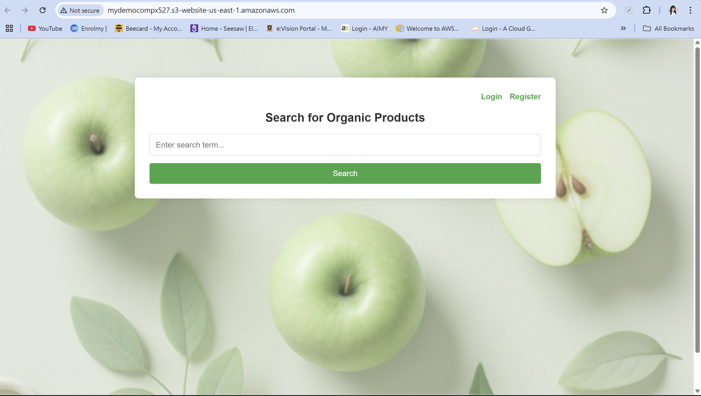

# Food Nutrition Website – Cloud-Based Fullstack Application

> A secure, cloud-based nutrition tracking system built with **React.js + Python**, deployed on **AWS**.

⚠️ **Note:** Backend services are currently offline to avoid unnecessary AWS hosting costs.  
However, both the frontend and backend codebases are available for review.

---
## About the Project

This fullstack cloud application was developed as part of COMPX527 – Secure Cloud Application Engineering
at the University of Waikato. I contributed as the frontend developer, while backend services were developed by my teammates.

##  Project Repositories

- 🌐 [Frontend Repository (React.js)](https://github.com/hinait/Nutrition_website_frontend)
- 🔧 [Backend Repository (Python)](https://github.com/hinait/Nutrition_website_backend)
---

##  System Architecture

This project follows a modular architecture with cloud deployment on AWS using Docker and Jenkins.

- Frontend hosted on S3 + CloudFront
- Backend deployed via EC2 (private subnet)** with Load Balancer
- Data stored in DynamoDB, with secure access via IAM and Secrets Manager

📷 [Click here to view the AWS Architecture Diagram](https://1drv.ms/f/c/90e734331ddc2501/EjMvh-mg6Y9Iua_YIB6zP-8B8TidBE_KwvglPjhCWrO35g?e=c1b1Mf)

---

##  Project Report

📝 [Read the full submission report (PDF)](https://1drv.ms/b/c/90e734331ddc2501/EeU4r6E6Dq5OjT8E7IE27HsBDENMRQjQ1zggGn8ID4-PbQ?e=OEUPmY)

---

##  Key Features

- OAuth2-based login and JWT authentication
- Nutrition search powered by USDA API
- User search history and usage statistics
- Secure cloud deployment and CI/CD with Jenkins

---

## Project UI

his is the homepage of the application before login. It displays the nutrition search field and basic navigation, and was originally hosted on an AWS URL.

  

👉 For more UI screens please navigate to this onedrive link, (https://1drv.ms/f/c/90e734331ddc2501/EhTe4B1bfbxNnng3716WUlUBQEl3AEQEqcVYkbgs7JVK1g?e=AVOcuI)

## 🛠 Tech Stack

| Layer        | Technology                     |
|--------------|--------------------------------|
| Frontend     | React.js, Axios, Bootstrap     |
| Backend      | Python, FastAPI, OAuth2, JWT   |
| API          | USDA Food Central              |
| Deployment   | Docker, EC2, CloudFront, S3    |
| CI/CD        | Jenkins                        |
| Database     | DynamoDB                       |
| Secrets Mgmt | AWS Secrets Manager            |
| Monitoring   | AWS CloudWatch                 |

---
